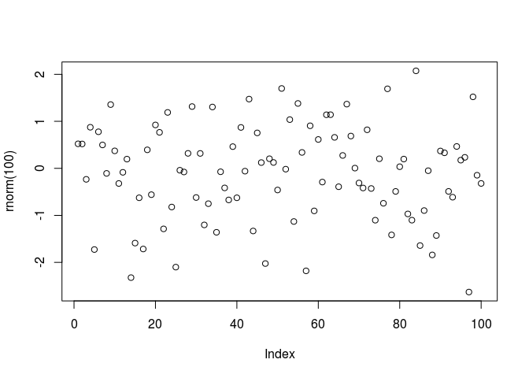
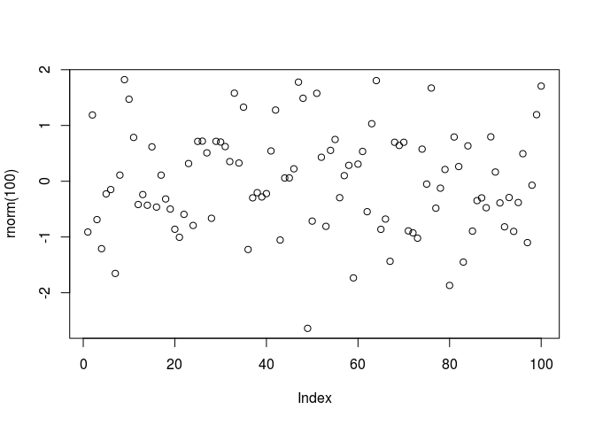
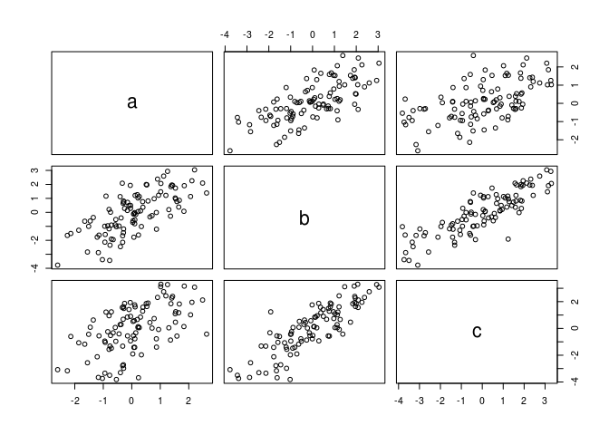
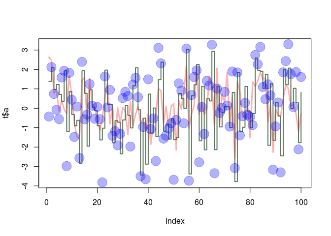
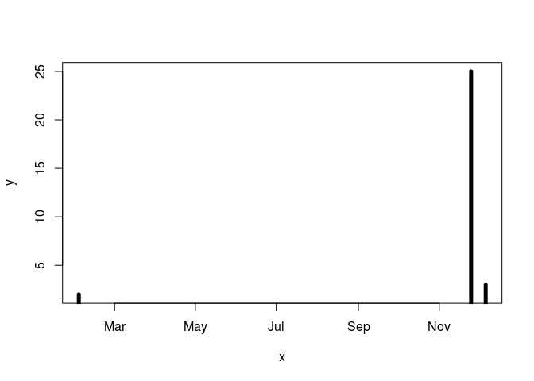

SRT411 Assignment 0
================
*By Jonathan Monteiro*

ToDo 3.1
--------

The result of ToDo 3.1: Calculator with 2014 changed to 2017 to reflect the current year:

``` r
((2017-2015)/(2017-1996))*100
```

    ## [1] 9.52381

ToDo 3.2
--------

The result of ToDo 3.1 but using vars

``` r
thisyear = 2017
yearstarted = 2015
bdayyear = 1996
((thisyear-yearstarted)/(thisyear-bdayyear))*100
```

    ## [1] 9.52381

ToDo 3.4
--------

Functions and Vectors

``` r
nums <- c(4,5,8,11)
sum(nums)
```

    ## [1] 28

ToDo 3.5
--------

Plotting

``` r
plot(rnorm(100))
```



ToDo 4
------

Getting help

``` r
?sqrt
```

ToDo 5
------

Saving commands to a script, and running a script

``` r
invisible(file.create("foo.R"))
writeLines("plot(rnorm(100))", file("foo.R"))
source("foo.R")
```



``` r
close(file("foo.R"))
```

ToDo 6.2
--------

Matrices and Sequences

``` r
P <- seq(31, 60)
Q <- matrix(P, 6, 5)
```

ToDo 6.3
--------

Data Frames

``` r
###This is how I would make the script
#invisible(file.create("foo.R"))
#writeLines("commands_go_here", file("foo.R"))
#source("foo.R")
###Since this assignment is a script itself, I am ommiting the part where we have to make a script
x1 <- rnorm(100)
x2 <- rnorm(100)
x3 <- rnorm(100)
t <- data.frame(a = x1, b= x1+x2, c= x1+x2+x3)
plot(t) #prints a 3x3 grid of plots, one for each col
```



``` r
#sd(t) #got error "cannot be coerced to type 'double'"
```

ToDo 7
------

Graphics

``` r
plot(t$a, type="l", ylim=range(t), lwd=3, col=rgb(1,0,0,0.3))
lines(t$b, type="s", lwd=2, col=rgb(0.3,0.4,0.3,0.9))
points(t$c, pch=20, cex=4, col=rgb(0,0,1,0.3))
```



``` r
# rgb is the color selection for the lines
# 'lwd' is the line width
# 'pch' is the symbol to be used for each points on the scatter plot
# 'cex' is the magnification factor of the points
```

ToDo 8
------

Reading and Writing Data Files

``` r
# If this gives an error, put 'txt1.txt' in your home folder or in your working dir if you changed it
d2 = read.table(file="tst1.txt", header=TRUE)
write.table(d2$g*5, file="tst2.txt")
```

ToDo 9
------

Not available data

``` r
# The message
## Warning message:
## In sqrt(rnorm(100)) : NaNs produced
# was thrown. You can't take the square route of "not a number", and the normal dist has NaNs in it, therefore the function will fail
```

ToDo 10.2
---------

Dates

``` r
x <- strptime(c("2017-02-02","2017-12-06", "2017-11-25"), format="%Y-%m-%d")
y <- c(2, 3, 25)
plot(x=x, y=y, type="h", lwd=5)
```



ToDo 11.2
---------

For loops

``` r
myVec <- 1:100
for (i in myVec){
  if ((i < 5) | (i > 90)){
    myVec[i] <- i*10
  }else{
    myVec[i] <- i*0.1
  }
}
```

ToDo 11.3
---------

Functions

``` r
wierdFunc <- function(myVec){
  for (i in myVec){
    if ((i < 5) | (i > 90)){
      myVec[i] <- i*10
    }else{
      myVec[i] <- i*0.1
    }
  }
  print(c("The length of the vec you gave me:", length(myVec)))
}
wierdFunc(1:300)
```

    ## [1] "The length of the vec you gave me:"
    ## [2] "300"

Mike Martin's ToDo
------------------

Based on the footnote at the end of ToDo 11.3 Proof that it is true

``` r
wierdFunc <- function(myVec){
  myVec[myVec < 5 | myVec > 90] <- myVec[myVec < 5 | myVec > 90]*10
  print(c("The length of the vec you gave me:", length(myVec)))
  return(myVec)
}
#testing the function
myVar <- 1:100
myVar <- wierdFunc(myVar)
```

    ## [1] "The length of the vec you gave me:"
    ## [2] "100"

``` r
head(myVar);tail(myVar)
```

    ## [1] 10 20 30 40  5  6

    ## [1]  950  960  970  980  990 1000
